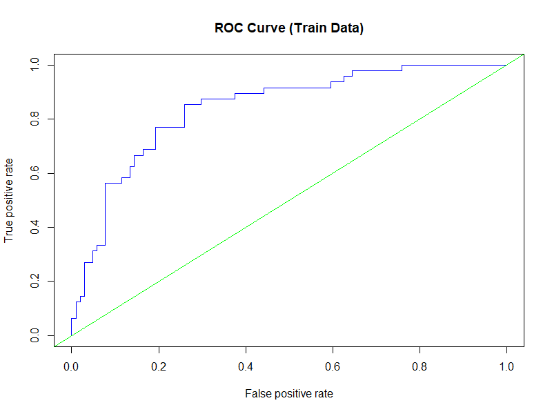

# Binary Logistic Regression: Risk Factors for Low Infant Birth Weight

## Project Overview
This project applies binary logistic regression in R to identify risk factors associated with low infant birth weight.  
The analysis evaluates maternal, medical, and behavioral factors and assesses model performance using classification metrics.

## Business / Clinical Context
Low birth weight is a critical public health concern associated with increased infant morbidity and mortality.  
Understanding maternal risk factors can support early intervention, clinical decision-making, and healthcare policy planning.

## Objectives
1. Identify significant predictors of low infant birth weight  
2. Build a binary logistic regression classification model  
3. Evaluate model performance using multiple cut-off values  
4. Assess classification accuracy, sensitivity, specificity, and ROC-AUC  

## Dataset
The dataset (`BIRTH_WEIGHT_csv.csv`) is included in the repository and located in the root directory.

### Dataset Description
Key variables:
- `LOW` — low birth weight indicator (1 = low, 0 = normal)  
- `AGE` — mother’s age (years)  
- `LWT` — mother’s weight at last menstrual period (lbs)  
- `RACE` — race category (White, Black, Other)  
- `SMOKE` — smoking during pregnancy (Yes / No)  
- `PTL` — history of premature labor  
- `HT` — history of hypertension  
- `UI` — uterine irritability  
- `FTV` — number of physician visits during first trimester  

## Analysis Workflow
1. Data import and preprocessing  
2. Variable encoding and factor conversion  
3. Exploratory cross-tabulation and chi-square testing  
4. Logistic regression model development  
5. Multicollinearity assessment (VIF)  
6. Train-test split (80% / 20%)  
7. Model evaluation using multiple probability cut-offs  
8. ROC curve analysis and AUC evaluation  

## Methods and Techniques
- Binary logistic regression
- Chi-square tests
- Classification metrics:
  - Accuracy
  - Sensitivity
  - Specificity
  - Misclassification rate
- ROC curve and AUC analysis
- Hold-out validation

## Key Findings
- Lower maternal weight, history of premature labor, hypertension, and uterine irritability are associated with increased risk of low birth weight  
- Multicollinearity was not detected among predictors  
- Model performance varies significantly depending on probability cut-off  
- Training data shows strong discriminatory power (AUC ≈ 0.84)  
- Testing performance is weaker, highlighting potential generalization limitations  

## Visualization

## Tools and Skills
- R
- Binary logistic regression
- Healthcare data analysis
- Classification metrics
- ROC-AUC evaluation
- Model validation

## How to Run the Project
1. Clone the repository  
2. Open the R script  
3. The dataset (`BIRTH_WEIGHT_csv.csv`) is already included in the repository  
4. Run the script sequentially  

## Notes
This project was completed for educational purposes and demonstrates applied classification modeling and evaluation in a healthcare context.
